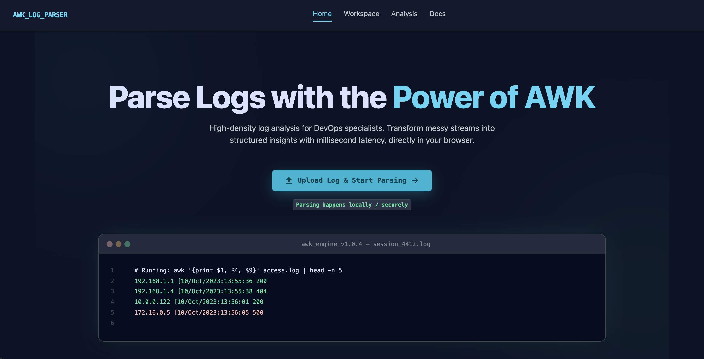

# AWK Log Parser

**Parse Apache and Nginx access logs directly in your browser with AWK-powered analysis.**

[](https://awk.developer-pro.com/)
[](LICENSE)

AWK Log Parser is a static, browser-based log analysis tool for Apache and Nginx access logs. It helps developers and sysadmins inspect access logs locally, run predefined analysis presets, and execute real AWK scripts in the browser through WebAssembly.

No backend. No uploads. No tracking by the app itself.

## Screenshot



## Why Use It?

Production access logs often contain sensitive IPs, URLs, user agents, and operational details. AWK Log Parser keeps that data on your machine while still giving you fast, familiar log analysis workflows in a clean web UI.

## Features

- Browser-based log parsing
- Real AWK execution through WebAssembly
- Apache/Nginx access log support
- Prebuilt analysis scripts and quick presets
- CSV export
- No backend
- No file uploads
- Privacy-first local processing
- Works as a static website
- JavaScript parser fallback for combined Apache/Nginx logs
- Web Worker-based processing for a more responsive UI
- Hash-routed sections for Home, Workspace, Analytics, and Docs
- Included sample log for quick testing
- Responsive dark terminal-style interface

## Privacy First

Your logs stay local:

- Log files are processed in your browser
- Files are not uploaded anywhere
- No server-side processing is required
- No tracking by the app itself
- AWK execution, when enabled, also runs locally in a Web Worker

## Live Demo

Open the hosted version here:

[https://awk.developer-pro.com/](https://awk.developer-pro.com/)

## Quick Start

Clone the repository and serve it as static files:

```bash
git clone https://github.com/pavelbohovin/awk-log-parser.git
cd awk-log-parser
python3 -m http.server 8080
```

Then open:

[http://127.0.0.1:8080/](http://127.0.0.1:8080/)

You can open `index.html` directly in a browser for simple viewing, but a local HTTP server is recommended because Web Workers and WebAssembly loading may not work reliably from `file://` URLs.

## Usage

1. Open the app in your browser.
2. Choose a log file, drag and drop one, or load the included sample log.
3. Select an analysis preset or switch to the AWK WASM engine.
4. Run the parser.
5. Review summary stats, tables, and AWK output.
6. Export CSV results when needed.

## AWK + WebAssembly

The app includes a real AWK engine compiled to WebAssembly:

- `assets/wasm/awk.js`
- `assets/wasm/awk.wasm`

When the AWK engine is selected, scripts run inside the browser through a Web Worker. This allows real AWK-style parsing without sending logs to a server.

The WebAssembly build is based on [One True Awk](https://github.com/onetrueawk/awk). See the [AWK WebAssembly build notes](assets/wasm/README.md) for build and troubleshooting details.

## Supported Log Formats

AWK Log Parser is designed for common Apache and Nginx access log workflows, especially combined/common-style access logs.

The JavaScript parser targets combined Apache/Nginx access log lines. Custom AWK scripts can handle additional layouts, but the app does not attempt to fully validate every possible server log format.

## Project Structure

```text
.
├── index.html
├── assets/
│   ├── css/
│   │   └── styles.css
│   ├── js/
│   │   ├── app.js
│   │   ├── awk-examples.js
│   │   ├── awk-wasm.js
│   │   ├── parser.worker.js
│   │   ├── presets.js
│   │   └── sample-log.js
│   ├── img/
│   │   ├── screenshot.png
│   │   └── servers.png
│   └── wasm/
│       ├── awk.js
│       ├── awk.wasm
│       └── README.md
├── sample-access.log
├── test-data/
│   └── sample-access.log
└── tools/
    ├── build-awk-wasm.sh
    └── test-awk-wasm-local.md
```

## Development

This is a vanilla HTML/CSS/JavaScript app. There is no backend and no required build step for everyday development.

Run it locally with any static file server:

```bash
python3 -m http.server 8080
```

Then open [http://127.0.0.1:8080/](http://127.0.0.1:8080/).

If you need to rebuild the AWK WebAssembly files, use the helper script documented in [assets/wasm/README.md](assets/wasm/README.md):

```bash
chmod +x tools/build-awk-wasm.sh
./tools/build-awk-wasm.sh
```

## Deployment

Because the project is static, it can be deployed to:

- GitHub Pages
- Netlify
- Cloudflare Pages
- Any static hosting provider
- Caddy, Nginx, or Apache as static files

Make sure the deployed site serves `assets/wasm/awk.wasm` with a valid WebAssembly MIME type when using the AWK engine.

## Roadmap

- More predefined AWK scripts
- Better log format detection
- Saved custom scripts
- Larger-file performance improvements
- More visual summaries
- Drag-and-drop upload refinements

## License

This project is licensed under the [MIT License](LICENSE).
